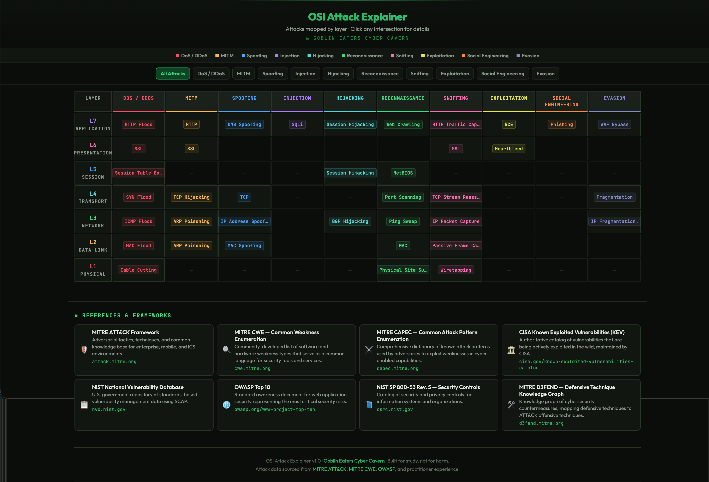

# OSI Attack Matrix

An interactive cybersecurity study tool that maps attack types across all seven OSI model layers, showing where and how each attack operates at the network stack level.

## What It Does

The matrix plots **attack categories** (DoS/DDoS, MITM, Injection, Credential Attacks, Session Hijacking, etc.) on the X axis against **OSI layers 1–7** on the Y axis. Each intersection that contains a known attack is clickable, opening a detail panel that explains:

- **What the attack is** — a concise description of the technique
- **How it's executed** — the mechanical steps an attacker follows
- **Why it lives at that layer** — what makes a Layer 2 DDoS fundamentally different from a Layer 7 DDoS

This distinction matters. A SYN flood (Layer 4) exhausts connection state tables, while an HTTP slowloris (Layer 7) holds application threads open — same category, completely different mechanics and defenses. The matrix makes these layer-specific differences visible and explorable.

## Why This Exists

Most cybersecurity study resources list attacks as flat inventories — names and definitions in a table. That approach fails to show the structural relationships between attacks and the network layers they target.

This tool was built as part of a CEH certification study program and is informed by the **Security Practitioner Model**, an original framework that maps the OSI stack to three practitioner domains:

- **Application (L5–L7)** — logic and interaction-based attacks
- **Network (L1–L3)** — transit and observation-based attacks
- **Host/Endpoint** — the substrate where all layers materialize

Layer 4 (Transport) sits at a shared boundary, and Identity/Access cuts across all layers as a cross-cutting dimension.

The matrix makes these domain boundaries tangible by letting you see which attacks cluster in each zone and which span multiple layers.

## How to Use

Open `osi-attack explainer.html` in any modern browser. No build tools, no dependencies, no server required — it's a single self-contained HTML file.

- Click any populated cell to open the detail panel
- Scroll horizontally across attack categories
- Each layer is color-coded for quick visual orientation

### Live Version

This tool is also hosted at [ubritsa.com/tools/osi-attack-explainer.html](https://ubritsa.com/tools/osi-attack-explainer) as part of the Goblin Eaters Cyber Cavern.

## Tech Stack

- Vanilla HTML, CSS, and JavaScript — no frameworks, no dependencies
- Dark theme with green accent palette (Goblin Eater branding)
- Responsive layout with mobile considerations

## Related Projects

- [Goblin Eaters Cyber Cavern](https://ubritsa.com) — cybersecurity blog
- [goblin-eater-theme](https://github.com/GoblinEater/goblin-eater-theme) — VS Code color theme

## Author

Keith Lawton — Technical Trainer and cybersecurity practitioner building tools that make complex security concepts mechanically understandable.

## License

MIT
